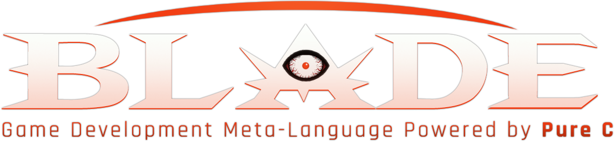
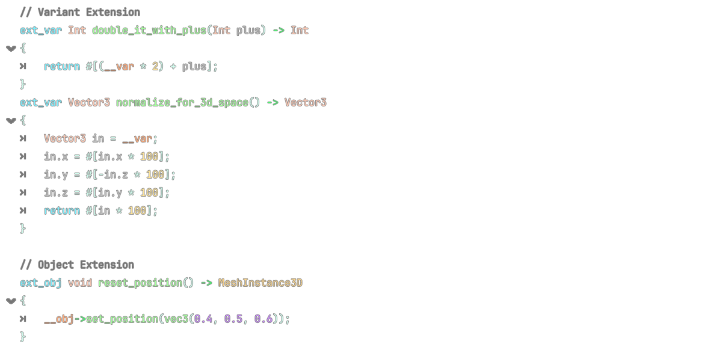
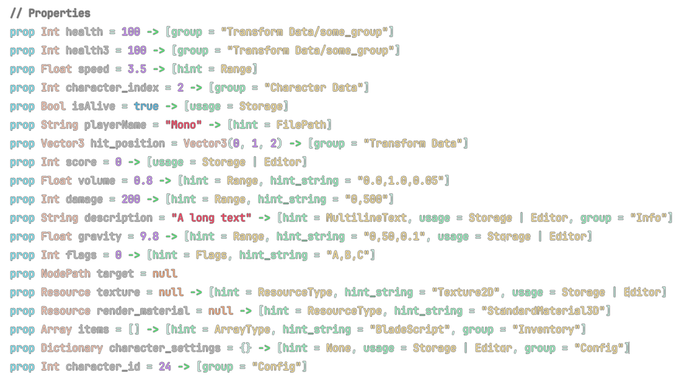

DRAFT - INITIAL COMMIT

# Blade Language

Blade is a fully-featured cross-platform* high-performance scripting meta-language for Godot Engine

## Overview

**Blade** is a language framework designed as a full replacement for GDScript by bringing a C family language with all the features required as an alternative. Blade is a meta language which get transpiled to pure C code and gets compiled to native machine code for best performance. 

### Features :

- Lightweight and Cross-Platform (~1.5MB)
- C Language Family Syntax
- Allows Direct Usage of C Language
- Supports All Core features of GDScript
- Extension System for Objects & Variants
- Flexible Kernel-Based Execution (Customizable)
- Supports Hot-Reloading and Tool System
- Supports Properties, Signals, Callbacks, Global Classes etc.
- Supports Keyword Definition and C-Like Macros
- Invoke Operating System C-Compatible API Directly
- Dedicated Syntax Highlighting and Script Editor
- Virtual File System for Imports and C Headers
- Minimal Reflection System and TAST (Tiny AST Parser)
- Direct Integration with Jenova Runtime (Real-Time C++)
- Dynamic Adaption of Godot API and Classes
- No VM, Uses Native JIT Execution

Blade Language doesn't support intellisence, autocomplete and interactive debugging yet.

## Requirements

Blade is a self-dependent extension, Blade defines a compiler interface which can be replaced and customized with any C compiler that supports in-memory compilation. However, default implementation relies on a custom version of TinyCC known as **TCCBE** (TinyCC Blade Edition) as current C compiler backend.

> Blade is **supported** on Windows (x64/x86/ARM64), Linux (x64/x86), Android (~~arm32~~/arm64) and ~~Web (WASM)~~  
> Blade is **not supported** on MacOS and iOS due to JIT execution restrictions.

> Blade itself by nature is supported on all platforms, However due to limitations of current C backend TinyCC it will not function on Web Assembly and arm-v7, To add support of these platforms it's required to replace current backend with a compiler with support of said platforms which must be driven from `BladeCompiler`

## Kernel-Based Execution

Blade is a very flexible language and its core, syntax and behavior can be customized easily.

- `blade_exec` – dispatches a method call on a `Object` types.
- `blade_vcall` – dispatches a method call on a raw `Variant` types.
- `blade_ucall` – calls a Godot *utility function* (Static, Non‑member)
- `blade_eval` – evaluates a binary operator between two `Variant` types.
- `blade_birth` – instantiates a new Godot object from a `Object` description.
- `blade_death` – destroys a previously created `Object`.
- `blade_cond` – converts an `Variant` result into a `Variant::BOOL` for control‑flow.

*The kernel‑based execution system can be extended to route function calls to a remote server, enabling distributed or cloud‑based execution of Blade scripts. This opens the door to hybrid local‑remote runtimes, where heavy computations or resource‑intensive operations are delegated elsewhere while the local engine remains lightweight.*

Additionally, this routing mechanism can be leveraged for multiplayer games: remote servers can host authoritative logic, synchronize state, and provide deterministic execution across clients, while the client engine focuses on rendering and local input handling.

## Extension System

In Blade, It's possible to add extension functions to any `Object` or `Variant` at any stage and any time.

## Direct Use of C Language

In any script file Blade transpiler can be dynamically switched using `blade_off` and `blade_on` to use C code directly in the block.

## Properties

In Blade, Creating properties is very easy and straight forward, It's a mix between GDScript and C++ methods.

## License

Blade is licensed under the permissive MIT and it's a part of [Jenova Framework](https://github.com/Jenova-Framework).